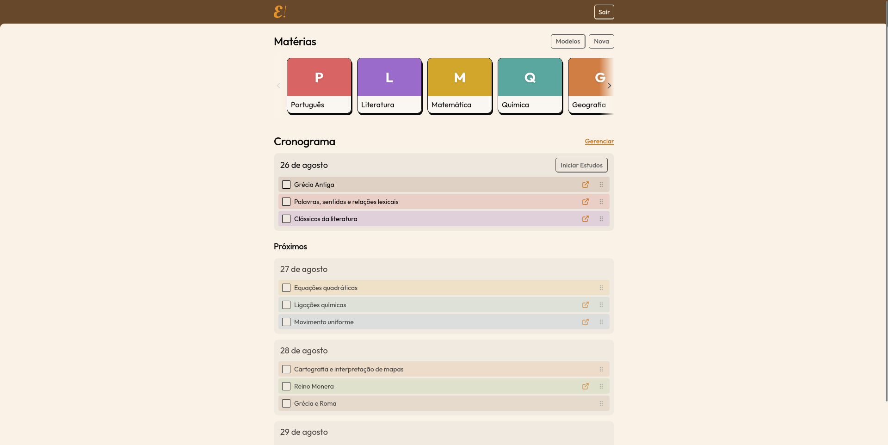
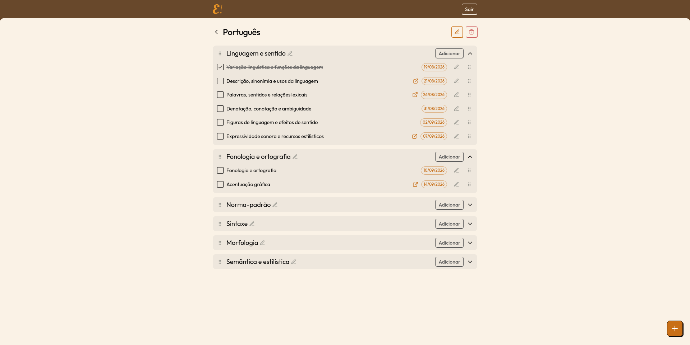
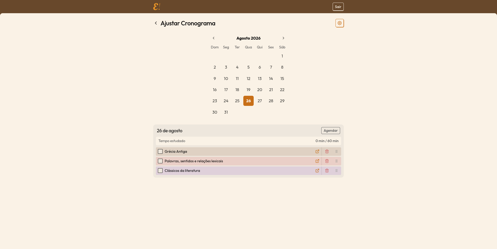
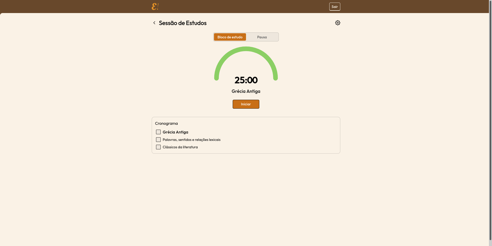
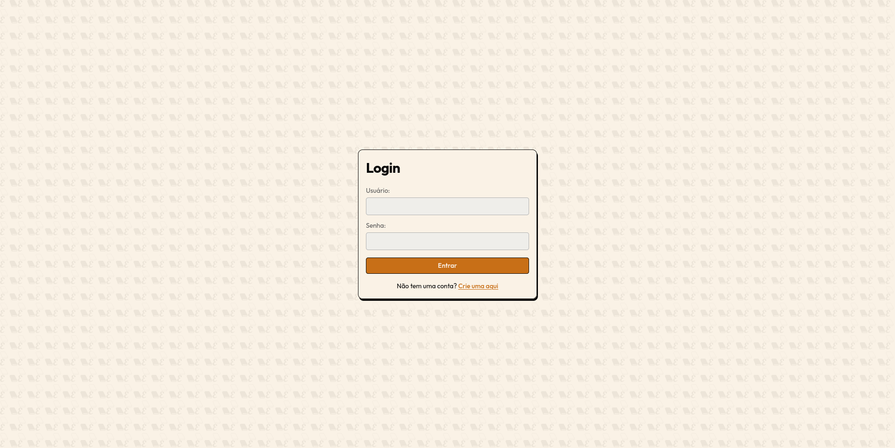

# Estude!

Estude! é um website feito para facilitar a gerência de cronogramas de estudos. Alunos podem criar e gerenciar um cronograma de estudos, anexando links para os materiais de escolha.

Link para esse repósitório: https://github.com/Sylverfish98/estude-pi
> **Nota: O vídeo de apresentação do projeto se encontra na pasta principal do repositório como 'demo_projeto.mp4'**

## Integrantes do Grupo
- Fernando Augusto De Araujo Martins
- Henrique Jorge Oliveira Almeida
- Gabriel Fonseca Sales
- João Gabriel Rodrigues De Jesus
- Guilherme Matheus Bussinger Torres Gonçalves Silveira

## Rodando o servidor de produção com Docker (recomendado)
Pré-requisito: [docker](https://www.docker.com/)

1. Navegue para a pasta raiz do projeto:
2. Suba o container docker (esse processo pode demorar um pouco):
```bash
docker compose -f docker/docker-compose.yml up
```
3. Abra o site em: [http://localhost:3000/login](http://localhost:3000/login)

- **Nota**: Caso seja necessário subir o container com o estado inicial novamente, por favor pare o mesmo e limpe os volumes com o seguinte comando:
```bash
docker compose -f ./docker/docker-compose.yml down && docker volume rm -f estude_estude-data && docker compose -f ./docker/docker-compose.yml up --build
```

##  Rodando localmente
Pré-requisito: [pnpm](https://pnpm.io/)

1. Instale as dependências e inicie o servidor de desenvolvimento:
```bash
pnpm install && pnpm db:generate && pnpm db:migrate && pnpm dev
```
2. Abra o site em: [http://localhost:3000/login](http://localhost:3000/login)

> **Por que o pnpm?**: pnpm é um package manager de Javascript que permite a escolha de uma data mínima de release para as dependências, diminuindo o risco de supply-chain attacks, comuns nesse ecossistema.

## Sobre a Aplicação
A plataforma permite a gerência de cronogramas de estudos, personalizados ou seguindo um modelo sugerido. Seguem as principais funcionalidades do projeto:

- **Gerência de matérias**: organize o conteúdo em matérias, divididas em tópicos, cada um com seus agendamentos de estudo. Agendamentos possuem um título e estado de conclusão, sendo opcionais um link para um material de estudo e a data de agendamento;
- **Tela inicial**: visualize suas matérias e a agenda dos próximos dias;
- **Cronograma (calendário)**: visualize e organize os itens agendados por dia, com ajuste de meta diária de estudo;
- **Sessão de estudos (Timer)**: modo Pomodoro para acompanhar o cronograma e gerir o tempo estudado;
- **Modelos de estudo (templates)**: planos prontos (ex.: um modelo completo para o ENEM) que podem ser importados de uma vez, criando matérias, tópicos e agendamentos automaticamente;
- **Autenticação própria**: cadastro/login com usuário e senha.

## Stack e Arquitetura

- [Next.js](https://nextjs.org/) (App Router) + React 19 + TypeScript;
- Tailwind CSS v4;
- Prisma 7 + SQLite;
- Autenticação própria: senha com bcrypt e sessão opaca em cookie httpOnly;
- Zod para validação de esquemas (ex.: dos modelos de estudo);
- Vitest para testes;
- `@dnd-kit` para reordenação por arrastar.

### Modelo de dados

```
User → Subject (matéria) → Topic (tópico) → Agendamento
         └── StudyDay (tempo estudado por dia)
```

- **User**: usuário com meta diária de estudo (`dailyStudyGoalMinutes`);
- **Subject**: matéria, com cor e ordem, pertence a um usuário;
- **Topic**: tópico dentro de uma matéria;
- **Agendamento**: item de estudo dentro de um tópico, contém nome, link e data opcionais, ordem, ordem do dia (`dayOrder`) e estado de conclusão;
- **StudyDay**: total de segundos estudados por usuário em um determinado dia;
- **Session**: sessão de autenticação (token + data de expiração).

## Scripts

| Script              | Descrição                                   |
| ------------------- |---------------------------------------------|
| `pnpm dev`          | Ambiente de desenvolvimento                 |
| `pnpm build`        | Gera o cliente do Prisma e builda o Next.js |
| `pnpm start`        | Inicia em modo produção                     |
| `pnpm preview`      | Build + start                               |
| `pnpm lint`         | ESLint                                      |
| `pnpm typecheck`    | Checagem de tipos (`tsc --noEmit`)          |
| `pnpm format`       | Verifica formatação (Prettier)              |
| `pnpm format:write` | Aplica formatação                           |
| `pnpm test`         | Executa os testes (Vitest)                  |
| `pnpm db:generate`  | Gera o client do Prisma                     |
| `pnpm db:migrate`   | Aplica migrations em desenvolvimento        |
| `pnpm db:seed`      | Popula o banco com um usuário e dados demo  |
| `pnpm db:studio`    | Abre o Prisma Studio                        |

## Galeria de Imagens

### Tela Inicial

### Matéria

### Cronograma

### Sessão de Estudos

### Login

